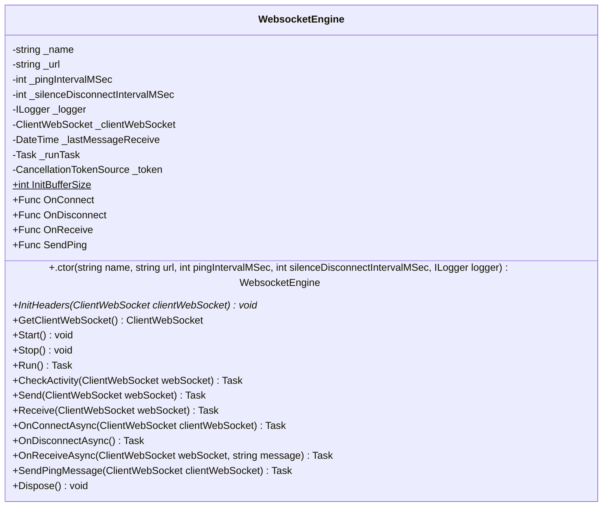

<!-- markdownlint-capture -->
<!-- markdownlint-disable -->

# Code Metrics

This file is dynamically maintained by a bot, *please do not* edit this by hand. It represents various [code metrics](https://aka.ms/dotnet/code-metrics), such as cyclomatic complexity, maintainability index, and so on.

## MyJetWallet.Sdk.WebSocket :heavy_check_mark:

The *MyJetWallet.Sdk.WebSocket.csproj* project file contains:

- 1 namespaces.
- 1 named types.
- 283 total lines of source code.
- Approximately 92 lines of executable code.
- The highest cyclomatic complexity is 6 :heavy_check_mark:.

  <strong id="myjetwallet-sdk-websocket">
    MyJetWallet.Sdk.WebSocket :heavy_check_mark:
  </strong>

 

The `MyJetWallet.Sdk.WebSocket` namespace contains 1 named types.

- 1 named types.
- 283 total lines of source code.
- Approximately 92 lines of executable code.
- The highest cyclomatic complexity is 6 :heavy_check_mark:.

  <strong id="websocketengine">
    WebsocketEngine :heavy_check_mark:
  </strong>

 

- The `WebsocketEngine` contains 28 members.
- 280 total lines of source code.
- Approximately 92 lines of executable code.
- The highest cyclomatic complexity is 6 :heavy_check_mark:.

| Member kind | Line number | Maintainability index | Cyclomatic complexity | Depth of inheritance | Class coupling | Lines of source / executable code |
| :-: | :-: | :-: | :-: | :-: | :-: | :-: |
| Field | <a href='https://github.com/MyJetWallet/MyJetWallet.Sdk.WebSocket/blob/master/src/MyJetWallet.Sdk.WebSocket/WebsocketEngine.cs#L18' title='ClientWebSocket WebsocketEngine._clientWebSocket'>18</a> | 100 | 0 :heavy_check_mark: | 0 | 1 | 1 / 0 |
| Field | <a href='https://github.com/MyJetWallet/MyJetWallet.Sdk.WebSocket/blob/master/src/MyJetWallet.Sdk.WebSocket/WebsocketEngine.cs#L20' title='DateTime WebsocketEngine._lastMessageReceive'>20</a> | 93 | 0 :heavy_check_mark: | 0 | 2 | 1 / 1 |
| Field | <a href='https://github.com/MyJetWallet/MyJetWallet.Sdk.WebSocket/blob/master/src/MyJetWallet.Sdk.WebSocket/WebsocketEngine.cs#L17' title='ILogger WebsocketEngine._logger'>17</a> | 100 | 0 :heavy_check_mark: | 0 | 1 | 1 / 0 |
| Field | <a href='https://github.com/MyJetWallet/MyJetWallet.Sdk.WebSocket/blob/master/src/MyJetWallet.Sdk.WebSocket/WebsocketEngine.cs#L13' title='string WebsocketEngine._name'>13</a> | 100 | 0 :heavy_check_mark: | 0 | 0 | 1 / 0 |
| Field | <a href='https://github.com/MyJetWallet/MyJetWallet.Sdk.WebSocket/blob/master/src/MyJetWallet.Sdk.WebSocket/WebsocketEngine.cs#L15' title='int WebsocketEngine._pingIntervalMSec'>15</a> | 100 | 0 :heavy_check_mark: | 0 | 0 | 1 / 0 |
| Field | <a href='https://github.com/MyJetWallet/MyJetWallet.Sdk.WebSocket/blob/master/src/MyJetWallet.Sdk.WebSocket/WebsocketEngine.cs#L24' title='Task WebsocketEngine._runTask'>24</a> | 100 | 0 :heavy_check_mark: | 0 | 1 | 1 / 0 |
| Field | <a href='https://github.com/MyJetWallet/MyJetWallet.Sdk.WebSocket/blob/master/src/MyJetWallet.Sdk.WebSocket/WebsocketEngine.cs#L16' title='int WebsocketEngine._silenceDisconnectIntervalMSec'>16</a> | 100 | 0 :heavy_check_mark: | 0 | 0 | 1 / 0 |
| Field | <a href='https://github.com/MyJetWallet/MyJetWallet.Sdk.WebSocket/blob/master/src/MyJetWallet.Sdk.WebSocket/WebsocketEngine.cs#L26' title='CancellationTokenSource WebsocketEngine._token'>26</a> | 93 | 0 :heavy_check_mark: | 0 | 1 | 1 / 1 |
| Field | <a href='https://github.com/MyJetWallet/MyJetWallet.Sdk.WebSocket/blob/master/src/MyJetWallet.Sdk.WebSocket/WebsocketEngine.cs#L14' title='string WebsocketEngine._url'>14</a> | 100 | 0 :heavy_check_mark: | 0 | 0 | 1 / 0 |
| Method | <a href='https://github.com/MyJetWallet/MyJetWallet.Sdk.WebSocket/blob/master/src/MyJetWallet.Sdk.WebSocket/WebsocketEngine.cs#L28' title='WebsocketEngine.WebsocketEngine(string name, string url, int pingIntervalMSec, int silenceDisconnectIntervalMSec, ILogger logger)'>28</a> | 72 | 1 :heavy_check_mark: | 0 | 1 | 9 / 5 |
| Method | <a href='https://github.com/MyJetWallet/MyJetWallet.Sdk.WebSocket/blob/master/src/MyJetWallet.Sdk.WebSocket/WebsocketEngine.cs#L121' title='Task WebsocketEngine.CheckActivity(ClientWebSocket webSocket)'>121</a> | 63 | 5 :heavy_check_mark: | 0 | 7 | 32 / 9 |
| Method | <a href='https://github.com/MyJetWallet/MyJetWallet.Sdk.WebSocket/blob/master/src/MyJetWallet.Sdk.WebSocket/WebsocketEngine.cs#L286' title='void WebsocketEngine.Dispose()'>286</a> | 100 | 1 :heavy_check_mark: | 0 | 0 | 4 / 1 |
| Method | <a href='https://github.com/MyJetWallet/MyJetWallet.Sdk.WebSocket/blob/master/src/MyJetWallet.Sdk.WebSocket/WebsocketEngine.cs#L45' title='ClientWebSocket WebsocketEngine.GetClientWebSocket()'>45</a> | 100 | 1 :heavy_check_mark: | 0 | 1 | 4 / 1 |
| Property | <a href='https://github.com/MyJetWallet/MyJetWallet.Sdk.WebSocket/blob/master/src/MyJetWallet.Sdk.WebSocket/WebsocketEngine.cs#L22' title='int WebsocketEngine.InitBufferSize'>22</a> | 100 | 2 :heavy_check_mark: | 0 | 0 | 1 / 1 |
| Method | <a href='https://github.com/MyJetWallet/MyJetWallet.Sdk.WebSocket/blob/master/src/MyJetWallet.Sdk.WebSocket/WebsocketEngine.cs#L43' title='void WebsocketEngine.InitHeaders(ClientWebSocket clientWebSocket)'>43</a> | 100 | 1 :heavy_check_mark: | 0 | 1 | 1 / 0 |
| Property | <a href='https://github.com/MyJetWallet/MyJetWallet.Sdk.WebSocket/blob/master/src/MyJetWallet.Sdk.WebSocket/WebsocketEngine.cs#L38' title='Func<ClientWebSocket, Task> WebsocketEngine.OnConnect'>38</a> | 100 | 2 :heavy_check_mark: | 0 | 3 | 1 / 0 |
| Method | <a href='https://github.com/MyJetWallet/MyJetWallet.Sdk.WebSocket/blob/master/src/MyJetWallet.Sdk.WebSocket/WebsocketEngine.cs#L250' title='Task WebsocketEngine.OnConnectAsync(ClientWebSocket clientWebSocket)'>250</a> | 80 | 2 :heavy_check_mark: | 0 | 4 | 8 / 3 |
| Property | <a href='https://github.com/MyJetWallet/MyJetWallet.Sdk.WebSocket/blob/master/src/MyJetWallet.Sdk.WebSocket/WebsocketEngine.cs#L39' title='Func<Task> WebsocketEngine.OnDisconnect'>39</a> | 100 | 2 :heavy_check_mark: | 0 | 2 | 1 / 0 |
| Method | <a href='https://github.com/MyJetWallet/MyJetWallet.Sdk.WebSocket/blob/master/src/MyJetWallet.Sdk.WebSocket/WebsocketEngine.cs#L259' title='Task WebsocketEngine.OnDisconnectAsync()'>259</a> | 81 | 2 :heavy_check_mark: | 0 | 3 | 8 / 3 |
| Property | <a href='https://github.com/MyJetWallet/MyJetWallet.Sdk.WebSocket/blob/master/src/MyJetWallet.Sdk.WebSocket/WebsocketEngine.cs#L40' title='Func<ClientWebSocket, string, Task> WebsocketEngine.OnReceive'>40</a> | 100 | 2 :heavy_check_mark: | 0 | 3 | 1 / 0 |
| Method | <a href='https://github.com/MyJetWallet/MyJetWallet.Sdk.WebSocket/blob/master/src/MyJetWallet.Sdk.WebSocket/WebsocketEngine.cs#L268' title='Task WebsocketEngine.OnReceiveAsync(ClientWebSocket webSocket, string message)'>268</a> | 79 | 2 :heavy_check_mark: | 0 | 4 | 8 / 3 |
| Method | <a href='https://github.com/MyJetWallet/MyJetWallet.Sdk.WebSocket/blob/master/src/MyJetWallet.Sdk.WebSocket/WebsocketEngine.cs#L183' title='Task WebsocketEngine.Receive(ClientWebSocket webSocket)'>183</a> | 50 | 6 :heavy_check_mark: | 0 | 8 | 66 / 25 |
| Method | <a href='https://github.com/MyJetWallet/MyJetWallet.Sdk.WebSocket/blob/master/src/MyJetWallet.Sdk.WebSocket/WebsocketEngine.cs#L75' title='Task WebsocketEngine.Run()'>75</a> | 54 | 4 :heavy_check_mark: | 0 | 8 | 45 / 19 |
| Method | <a href='https://github.com/MyJetWallet/MyJetWallet.Sdk.WebSocket/blob/master/src/MyJetWallet.Sdk.WebSocket/WebsocketEngine.cs#L154' title='Task WebsocketEngine.Send(ClientWebSocket webSocket)'>154</a> | 62 | 4 :heavy_check_mark: | 0 | 7 | 28 / 10 |
| Property | <a href='https://github.com/MyJetWallet/MyJetWallet.Sdk.WebSocket/blob/master/src/MyJetWallet.Sdk.WebSocket/WebsocketEngine.cs#L41' title='Func<ClientWebSocket, Task> WebsocketEngine.SendPing'>41</a> | 100 | 2 :heavy_check_mark: | 0 | 3 | 1 / 0 |
| Method | <a href='https://github.com/MyJetWallet/MyJetWallet.Sdk.WebSocket/blob/master/src/MyJetWallet.Sdk.WebSocket/WebsocketEngine.cs#L277' title='Task WebsocketEngine.SendPingMessage(ClientWebSocket clientWebSocket)'>277</a> | 80 | 2 :heavy_check_mark: | 0 | 4 | 8 / 3 |
| Method | <a href='https://github.com/MyJetWallet/MyJetWallet.Sdk.WebSocket/blob/master/src/MyJetWallet.Sdk.WebSocket/WebsocketEngine.cs#L50' title='void WebsocketEngine.Start()'>50</a> | 79 | 2 :heavy_check_mark: | 0 | 6 | 10 / 3 |
| Method | <a href='https://github.com/MyJetWallet/MyJetWallet.Sdk.WebSocket/blob/master/src/MyJetWallet.Sdk.WebSocket/WebsocketEngine.cs#L61' title='void WebsocketEngine.Stop()'>61</a> | 77 | 2 :heavy_check_mark: | 0 | 4 | 13 / 4 |

<a href="#WebsocketEngine-class-diagram">:link: to `WebsocketEngine` class diagram</a>

<a href="#myjetwallet-sdk-websocket">:top: back to MyJetWallet.Sdk.WebSocket</a>

<a href="#myjetwallet-sdk-websocket">:top: back to MyJetWallet.Sdk.WebSocket</a>

## Metric definitions

  - **Maintainability index**: Measures ease of code maintenance. Higher values are better.
  - **Cyclomatic complexity**: Measures the number of branches. Lower values are better.
  - **Depth of inheritance**: Measures length of object inheritance hierarchy. Lower values are better.
  - **Class coupling**: Measures the number of classes that are referenced. Lower values are better.
  - **Lines of source code**: Exact number of lines of source code. Lower values are better.
  - **Lines of executable code**: Approximates the lines of executable code. Lower values are better.

## Mermaid class diagrams

##### `WebsocketEngine` class diagram

*This file is maintained by a bot.*

<!-- markdownlint-restore -->
